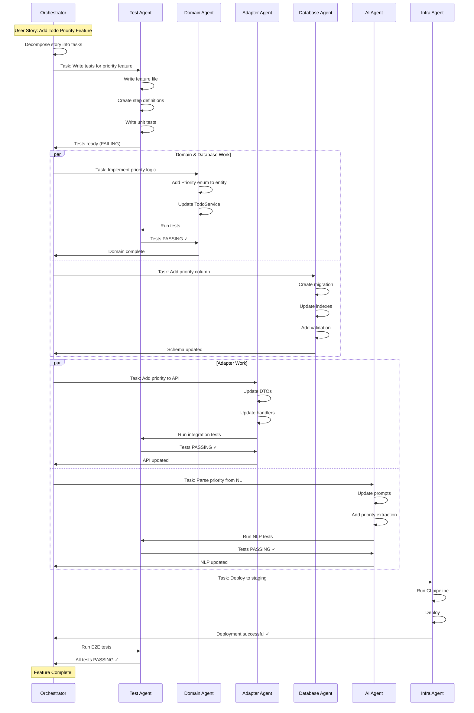

# Multi-Agent Development Architecture

## Overview

This project is designed to be implemented using **specialized AI agents** (sub-agents), where each agent focuses on a specific architectural layer or concern. This approach ensures high-quality, maintainable code with clear separation of responsibilities.

## Why Multi-Agent Development?

### Benefits

✅ **Specialized Expertise** - Each agent focuses on what it does best
✅ **Parallel Development** - Multiple agents can work simultaneously
✅ **Consistent Quality** - Each layer follows best practices for that domain
✅ **Faster Development** - Agents work in parallel on different concerns
✅ **Better Testing** - Test-first agent ensures comprehensive coverage
✅ **Clean Architecture** - Domain agent maintains hexagonal architecture principles

### Challenges Addressed

❌ **Monolithic AI Context** - One agent trying to handle everything leads to errors
❌ **Mixed Concerns** - Business logic mixed with infrastructure code
❌ **Inconsistent Patterns** - Different parts of codebase using different approaches
❌ **Poor Test Coverage** - Tests written as afterthought
❌ **Architecture Violations** - Domain layer depending on infrastructure

## Multi-Agent Architecture Diagram

```
┌─────────────────────────────────────────────────────────────────────────┐
│                        ORCHESTRATOR AGENT                               │
│  Role: Project coordination, task decomposition, integration            │
│  Model: Claude 3.5 Sonnet (Anthropic)                                   │
│  Skills: Project management, architecture review, integration testing   │
└────────────────────────────┬────────────────────────────────────────────┘
                             │
                             │ Coordinates & Reviews
                             │
        ┌────────────────────┼────────────────────┐
        │                    │                    │
        ▼                    ▼                    ▼
┌───────────────┐    ┌───────────────┐   ┌───────────────┐
│  TEST AGENT   │    │  CODE AGENT   │   │   DB AGENT    │
│   (BDD/TDD)   │    │   (Domain)    │   │  (Schema)     │
│               │    │               │   │               │
│ - Feature     │    │ - Entities    │   │ - Migrations  │
│   Files       │    │ - Services    │   │ - Indexes     │
│ - Step Defs   │    │ - Ports       │   │ - RLS         │
│ - Unit Tests  │    │ - Logic       │   │ - Queries     │
└───────┬───────┘    └───────┬───────┘   └───────┬───────┘
        │                    │                    │
        ▼                    ▼                    ▼
┌───────────────┐    ┌───────────────┐   ┌───────────────┐
│ADAPTER AGENT  │    │   AI AGENT    │   │  INFRA AGENT  │
│  (HTTP/Bot)   │    │  (NLP/ML)     │   │  (CI/CD)      │
│               │    │               │   │               │
│ - Echo API    │    │ - Perplexity  │   │ - GitHub      │
│ - Telegram    │    │ - Prompts     │   │   Actions     │
│ - DTOs        │    │ - Parsing     │   │ - Docker      │
│ - Middleware  │    │ - Multilang   │   │ - Railway     │
└───────────────┘    └───────────────┘   └───────────────┘
```

## Agent Roles & Responsibilities

### Orchestrator Agent
**Role**: Project coordinator and integration manager

**Responsibilities**:
- Decompose user stories into agent-specific tasks
- Coordinate work between specialized agents
- Review integration points
- Run end-to-end tests
- Verify acceptance criteria
- Manage dependencies between agents

**When Active**: Throughout the entire development lifecycle

### Test-First Agent (Agent 1)
**Role**: BDD/TDD specialist - writes tests BEFORE implementation

**Responsibilities**:
- Write Gherkin feature files
- Create step definitions
- Write unit test stubs
- Verify tests fail (RED state)
- Run tests after implementation
- Verify acceptance criteria

**When Active**: First in the workflow (before any code)

### Domain Logic Agent (Agent 2)
**Role**: Business logic specialist - implements core domain

**Responsibilities**:
- Design domain entities
- Define port interfaces
- Implement application services
- Enforce business rules
- Make tests GREEN
- Refactor domain code

**When Active**: After tests are written, before adapters

### Database Schema Agent (Agent 3)
**Role**: Data modeling specialist - designs schema

**Responsibilities**:
- Design normalized schemas
- Create migrations
- Define indexes
- Implement RLS policies
- Optimize queries
- Write repository implementations

**When Active**: In parallel with domain logic (can work independently)

### HTTP/Bot Adapter Agent (Agent 4)
**Role**: Interface specialist - implements driving adapters

**Responsibilities**:
- Implement Echo REST API
- Implement Telegram bot
- Create DTOs
- Add middleware (auth, logging, CORS)
- Map requests to domain calls
- Handle errors with proper status codes

**When Active**: After domain logic is complete

### AI/NLP Agent (Agent 5)
**Role**: Machine learning specialist - AI integration

**Responsibilities**:
- Design intent schema
- Craft Perplexity prompts
- Parse AI responses
- Implement multilingual support
- Handle ambiguous queries
- Optimize for accuracy and performance

**When Active**: In parallel with adapters (driven adapter)

### Infrastructure/DevOps Agent (Agent 6)
**Role**: CI/CD specialist - deployment and operations

**Responsibilities**:
- Create GitHub Actions workflows
- Build Docker images
- Configure Railway deployment
- Set up monitoring
- Implement logging
- Document deployment process

**When Active**: Throughout development, finalizing before deployment

## Agent Coordination Workflow

### Phase 1: Feature Definition
```
Orchestrator Agent:
├── Read user story
├── Decompose into tasks
├── Assign to specialized agents
└── Define acceptance criteria
```

### Phase 2: Test-First (RED)
```
Test-First Agent:
├── Write feature file (Gherkin)
├── Create step definitions
├── Write unit test stubs
├── Verify all tests FAIL
└── Report: Tests RED ❌
```

### Phase 3: Domain Implementation (GREEN)
```
Domain Logic Agent:
├── Read failing tests
├── Design entities
├── Define port interfaces
├── Implement services
├── Run tests
└── Report: Tests GREEN ✅

Database Schema Agent (in parallel):
├── Design schema from entities
├── Create migrations
├── Define indexes
└── Implement RLS policies
```

### Phase 4: Adapter Implementation
```
HTTP/Bot Adapter Agent:
├── Implement Echo REST API
├── Implement Telegram bot
├── Create DTOs
├── Add middleware
├── Run integration tests
└── Report: Integration tests GREEN ✅

AI/NLP Agent (in parallel):
├── Design intent schema
├── Craft prompts
├── Implement parser
└── Test multilingual support
```

### Phase 5: Infrastructure Setup
```
Infrastructure Agent:
├── Create Dockerfile
├── Set up GitHub Actions
├── Configure Railway
├── Add monitoring
└── Report: Deployment ready ✅
```

### Phase 6: Integration Review
```
Orchestrator Agent:
├── Run full test suite
├── Review code quality
├── Verify architecture compliance
├── Check acceptance criteria
└── Report: Feature complete ✅
```

## Communication Between Agents

### Data Flow Between Agents

```
Test Agent                Domain Agent              Adapter Agent
    │                         │                         │
    │ 1. Feature File         │                         │
    ├────────────────────────>│                         │
    │                         │                         │
    │ 2. Failing Tests        │                         │
    ├────────────────────────>│                         │
    │                         │                         │
    │                         │ 3. Domain Interfaces    │
    │                         ├────────────────────────>│
    │                         │                         │
    │ 4. Run Tests            │                         │
    │<────────────────────────┤                         │
    │                         │                         │
    │ 5. Integration Tests    │                         │
    ├─────────────────────────────────────────────────>│
    │                         │                         │
```

### Shared Context

All agents have access to:
- **Documentation**: `docs/` directory
- **Architecture**: Hexagonal architecture principles
- **Standards**: Go idioms and conventions
- **Testing**: Test-first methodology

Each agent has specialized access to:
- **Test Agent**: `features/`, `test/`
- **Domain Agent**: `internal/domain/`
- **Adapter Agent**: `internal/adapter/`
- **Database Agent**: `migrations/`, `internal/adapter/driven/postgres/`
- **AI Agent**: `internal/adapter/driven/perplexity/`
- **Infra Agent**: `.github/`, `Dockerfile`, `railway.toml`

## Agent Handoffs

### Test → Domain Handoff
**Input to Domain Agent**:
- Feature files with scenarios
- Failing step definitions
- Failing unit tests
- Domain model sketches

**Output from Domain Agent**:
- Implemented entities
- Port interfaces defined
- Services implemented
- All unit tests passing

### Domain → Adapter Handoff
**Input to Adapter Agent**:
- Port interfaces
- Domain entities (for DTO mapping)
- Service methods
- Integration test stubs

**Output from Adapter Agent**:
- HTTP handlers implemented
- Telegram bot handlers implemented
- DTOs created
- All integration tests passing

### All → Infra Handoff
**Input to Infra Agent**:
- Complete application code
- Test suite
- Environment requirements
- Deployment requirements

**Output from Infra Agent**:
- Dockerfile
- CI/CD pipelines
- Deployment configuration
- Monitoring setup

## Sequence Diagram: Feature Implementation



## Best Practices for Multi-Agent Development

### For Orchestrator
✅ **Clear Task Boundaries** - Define what each agent should do
✅ **Acceptance Criteria** - Provide measurable success criteria
✅ **Dependency Management** - Ensure agents have what they need
✅ **Progress Tracking** - Monitor each agent's checkpoint
✅ **Integration Testing** - Verify all pieces work together

### For All Agents
✅ **Stay in Lane** - Focus on your specialty, don't cross boundaries
✅ **Follow Architecture** - Respect hexagonal architecture principles
✅ **Test Everything** - Write tests for your layer
✅ **Document Changes** - Update relevant docs
✅ **Clean Code** - Follow Go idioms and conventions

### For Handoffs
✅ **Clear Interfaces** - Provide well-defined contracts
✅ **Complete Context** - Share all necessary information
✅ **Verify Assumptions** - Check that inputs are valid
✅ **Test Integration** - Verify handoff points work
✅ **Document Dependencies** - Note what depends on what

## Parallel vs Sequential Work

### Can Work in Parallel
- Domain Logic Agent + Database Schema Agent
- HTTP Adapter Agent + AI/NLP Agent
- Test execution across all layers

### Must Work Sequentially
1. Test Agent (writes tests) → before → Domain Agent (implements)
2. Domain Agent (defines interfaces) → before → Adapter Agent (implements)
3. All implementation → before → Infrastructure Agent (deploys)

## Checkpoints & Validation

### After Each Agent Completes

| Agent | Checkpoint | Validation |
|-------|-----------|------------|
| Test Agent | Tests written | All tests FAIL (RED) |
| Domain Agent | Logic implemented | Unit tests PASS (GREEN) |
| Database Agent | Schema created | Migrations apply successfully |
| Adapter Agent | Interfaces ready | Integration tests PASS |
| AI Agent | NLP working | Intent parsing accurate |
| Infra Agent | Deployed | Application accessible |

### Final Integration Checkpoint
- ✅ All unit tests pass
- ✅ All BDD scenarios pass
- ✅ All integration tests pass
- ✅ Application builds successfully
- ✅ Deployment succeeds
- ✅ Acceptance criteria met

## Next Steps

- Read [Agent Specifications](19-agent-specifications.md) for detailed agent configs
- See [AI Model Recommendations](20-ai-model-recommendations.md) for model selection
- Review [TDD/BDD Workflow](04-tdd-bdd-workflow.md) for test-first approach
