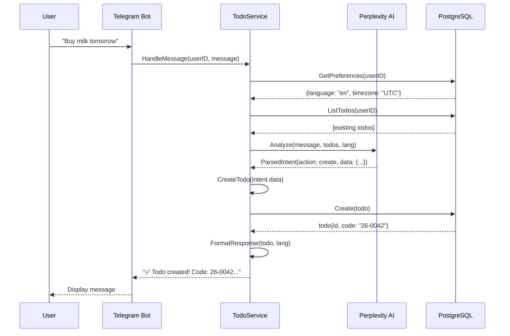

# Message Flow

## Overview

This document describes the request/response flow through the hexagonal architecture for both Telegram bot and REST API interfaces.

## Complete Message Flow

### Telegram Bot Flow

```
┌─────────────┐
│   Telegram  │
│    User     │
└──────┬──────┘
       │ "Buy milk tomorrow"
       ▼
┌─────────────────────────────────────────────────┐
│            TELEGRAM BOT ADAPTER                 │
│  (internal/adapter/driving/telegram/bot.go)     │
│                                                  │
│  1. Receive message via telebot                 │
│  2. Extract userID, message text                │
│  3. Send typing indicator                       │
└──────┬──────────────────────────────────────────┘
       │ HandleMessage(ctx, userID, "Buy milk tomorrow")
       ▼
┌─────────────────────────────────────────────────┐
│              DOMAIN SERVICE                     │
│  (internal/domain/service/todo_service.go)      │
│                                                  │
│  4. Get user preferences (language, timezone)   │
│  5. Call IntentAnalyzer with context            │
└──────┬──────────────────────────────────────────┘
       │ Analyze(ctx, message, existingTodos, lang)
       ▼
┌─────────────────────────────────────────────────┐
│           PERPLEXITY AI ADAPTER                 │
│  (internal/adapter/driven/perplexity/client.go) │
│                                                  │
│  6. Build prompt with context                   │
│  7. Call Perplexity API (HTTP)                  │
│  8. Parse JSON response                         │
└──────┬──────────────────────────────────────────┘
       │ ParsedIntent{action: create, data: {...}}
       ▼
┌─────────────────────────────────────────────────┐
│              DOMAIN SERVICE                     │
│                                                  │
│  9. Route to appropriate action (create)        │
│  10. Validate business rules                    │
│  11. Create Todo entity                         │
└──────┬──────────────────────────────────────────┘
       │ Create(ctx, todo)
       ▼
┌─────────────────────────────────────────────────┐
│          POSTGRESQL ADAPTER                     │
│  (internal/adapter/driven/postgres/todo_repo.go)│
│                                                  │
│  12. Auto-generate code (trigger)               │
│  13. Insert into database                       │
│  14. Return created todo with ID, code          │
└──────┬──────────────────────────────────────────┘
       │ todo with code "26-0042"
       ▼
┌─────────────────────────────────────────────────┐
│              DOMAIN SERVICE                     │
│                                                  │
│  15. Format response using i18n                 │
│  16. Return localized success message           │
└──────┬──────────────────────────────────────────┘
       │ "✅ Todo created! Code: 26-0042..."
       ▼
┌─────────────────────────────────────────────────┐
│            TELEGRAM BOT ADAPTER                 │
│                                                  │
│  17. Send message with Markdown formatting      │
└──────┬──────────────────────────────────────────┘
       │
       ▼
┌─────────────┐
│   Telegram  │
│    User     │
└─────────────┘
  Receives: "✅ Todo created!
            Code: `26-0042`
            Title: Buy milk..."
```

### REST API Flow

```
┌─────────────┐
│  HTTP       │
│  Client     │
└──────┬──────┘
       │ POST /api/v1/todos
       │ {"title": "Buy milk", "priority": "high"}
       ▼
┌─────────────────────────────────────────────────┐
│             ECHO REST API ADAPTER               │
│  (internal/adapter/driving/http/server.go)      │
│                                                  │
│  1. Parse JSON request body                     │
│  2. Validate DTO (CreateTodoRequest)            │
│  3. Extract userID from JWT/API key             │
│  4. Map DTO to domain request                   │
└──────┬──────────────────────────────────────────┘
       │ CreateTodo(ctx, CreateRequest)
       ▼
┌─────────────────────────────────────────────────┐
│              DOMAIN SERVICE                     │
│  (internal/domain/service/todo_service.go)      │
│                                                  │
│  5. Apply business rules                        │
│  6. Create Todo entity                          │
│  7. Validate entity                             │
└──────┬──────────────────────────────────────────┘
       │ Create(ctx, todo)
       ▼
┌─────────────────────────────────────────────────┐
│          POSTGRESQL ADAPTER                     │
│                                                  │
│  8. Auto-generate code (trigger)                │
│  9. Insert into database                        │
│  10. Return created todo                        │
└──────┬──────────────────────────────────────────┘
       │ todo with ID, code, timestamps
       ▼
┌─────────────────────────────────────────────────┐
│              DOMAIN SERVICE                     │
│                                                  │
│  11. Return created todo                        │
└──────┬──────────────────────────────────────────┘
       │ todo entity
       ▼
┌─────────────────────────────────────────────────┐
│             ECHO REST API ADAPTER               │
│                                                  │
│  12. Map entity to DTO (TodoResponse)           │
│  13. Return JSON response with 201 Created      │
└──────┬──────────────────────────────────────────┘
       │ 201 Created
       │ {"id": "...", "code": "26-0042", ...}
       ▼
┌─────────────┐
│  HTTP       │
│  Client     │
└─────────────┘
```

## Detailed Flow by Action

### 1. Create Todo Flow



### 2. List Todos Flow

```
User → Telegram Bot: "/list"
  ↓
Telegram Bot → TodoService: ListTodos(userID, filters)
  ↓
TodoService → PostgreSQL: List(userID, filters)
  ↓
PostgreSQL → TodoService: [todos]
  ↓
TodoService → i18n: Format list with translations
  ↓
TodoService → Telegram Bot: formatted list
  ↓
Telegram Bot → User: "📋 Your Todos (3)..."
```

### 3. Complete Todo Flow

```
User → Telegram Bot: "Done 26-0042"
  ↓
Telegram Bot → TodoService: HandleMessage(userID, message)
  ↓
TodoService → Perplexity AI: Analyze("Done 26-0042", ...)
  ↓
Perplexity AI → TodoService: ParsedIntent{action: complete, data: {todo_id: "26-0042"}}
  ↓
TodoService → PostgreSQL: GetByCode(userID, "26-0042")
  ↓
PostgreSQL → TodoService: todo
  ↓
TodoService → PostgreSQL: Update(todo{status: completed})
  ↓
PostgreSQL → TodoService: updated todo (trigger sets completed_at)
  ↓
TodoService → i18n: Format completion message
  ↓
TodoService → Telegram Bot: "✅ Todo completed!"
  ↓
Telegram Bot → User: Display message
```

### 4. Search Todos Flow

```
User → REST API: GET /api/v1/todos/search?q=groceries
  ↓
REST API → Middleware: Authenticate
  ↓
Middleware → REST API: userID from token
  ↓
REST API → TodoService: SearchTodos(userID, "groceries")
  ↓
TodoService → PostgreSQL: Search(userID, query)
  ↓
PostgreSQL (full-text search) → TodoService: [matching todos]
  ↓
TodoService → REST API: [todos]
  ↓
REST API → User: JSON response with results
```

## Error Handling Flow

### Invalid Request

```
User → Telegram Bot: "invalid gibberish xyzabc"
  ↓
Telegram Bot → TodoService: HandleMessage(...)
  ↓
TodoService → Perplexity AI: Analyze(...)
  ↓
Perplexity AI → TodoService: ParsedIntent{
    action: unknown,
    confidence: 0.3
}
  ↓
TodoService: Check confidence threshold
  ↓
TodoService → i18n: Get "error.invalid_input" message
  ↓
TodoService → Telegram Bot: Error message in user's language
  ↓
Telegram Bot → User: "❌ Could not understand. Try /help"
```

### Database Error

```
User → REST API: POST /api/v1/todos
  ↓
REST API → TodoService: CreateTodo(...)
  ↓
TodoService → PostgreSQL: Create(todo)
  ↓
PostgreSQL: Connection error
  ↓
PostgreSQL → TodoService: error
  ↓
TodoService: Log error details
  ↓
TodoService → REST API: error
  ↓
REST API → User: 500 Internal Server Error
    {
      "error": {
        "code": "INTERNAL_ERROR",
        "message": "An error occurred"
      }
    }
```

## Caching & Optimization

### Template Caching

```
User → Telegram Bot: "Create daily standup"
  ↓
Telegram Bot → TodoService: HandleMessage(...)
  ↓
TodoService → TemplateService: CreateFromTemplate("daily-standup", {})
  ↓
TemplateService → File Cache: Get("daily-standup")
  ↓
File Cache → TemplateService: template (cached)
  ↓
TemplateService: Instantiate template
  ↓
TemplateService → TodoService: todo from template
  ↓
TodoService → PostgreSQL: Create(todo)
  ↓
... (continue normal flow)
```

### User Preferences Caching

```
Multiple requests from same user within short time:

Request 1:
  TodoService → PostgreSQL: GetPreferences(userID)
  PostgreSQL → Cache: Store preferences
  
Request 2 (< 5 min later):
  TodoService → Cache: GetPreferences(userID)
  Cache → TodoService: cached preferences (no DB call)
```

## Performance Metrics

### Typical Latencies

| Flow | Adapter Overhead | Domain Logic | DB Query | AI Call | Total |
|------|------------------|--------------|----------|---------|-------|
| Create (with AI) | ~5ms | ~2ms | ~10ms | ~500-1000ms | ~520ms |
| Create (no AI) | ~5ms | ~2ms | ~10ms | 0ms | ~20ms |
| List | ~5ms | ~1ms | ~15ms | 0ms | ~25ms |
| Complete | ~5ms | ~2ms | ~10ms | 0ms | ~20ms |
| Search | ~5ms | ~1ms | ~50ms | 0ms | ~60ms |

### Bottlenecks

1. **Perplexity AI call** (~500-1000ms) - Largest latency
2. **Full-text search** (~50ms) - Can be optimized with better indexes
3. **Database connection** (~10ms) - Mitigated by connection pooling

## Request/Response Examples

### Telegram Bot: Create Todo

**Request**:
```
User sends: "Buy milk tomorrow high priority #shopping"
```

**Internal Flow**:
```
1. Telegram adapter receives message
2. TodoService.HandleMessage(123456789, "Buy milk tomorrow high priority #shopping")
3. Get user prefs: {language: "en", timezone: "UTC"}
4. AI analyzes: ParsedIntent{
     action: "create",
     data: {
       title: "Buy milk",
       due_date: "2026-01-11T00:00:00Z",
       priority: "high",
       tags: ["shopping"]
     }
   }
5. Create todo in DB
6. Format response with i18n
```

**Response**:
```
✅ Todo created!

Code: `26-0042`
Title: Buy milk
Priority: 🔴 High
Due: Jan 11, 12:00 AM
Tags: shopping
```

### REST API: List Todos

**Request**:
```http
GET /api/v1/todos?status=pending&limit=5
Authorization: Bearer eyJhbGc...
```

**Internal Flow**:
```
1. Echo adapter receives request
2. Auth middleware validates JWT
3. Extract userID from token: 123456789
4. TodoService.ListTodos(123456789, {status: "pending", limit: 5})
5. PostgreSQL query with filters
6. Map entities to DTOs
```

**Response**:
```json
{
  "todos": [
    {
      "id": "123e4567-e89b-12d3-a456-426614174000",
      "code": "26-0042",
      "title": "Buy milk",
      "priority": "high",
      "status": "pending",
      "tags": ["shopping"],
      "created_at": "2026-01-10T12:00:00Z"
    }
  ],
  "total": 1,
  "limit": 5,
  "offset": 0
}
```

## Architecture Benefits

### 1. Testability

Each layer can be tested independently:
- **Adapters**: Mock domain services
- **Domain**: Mock repositories and AI
- **Repositories**: Use test database

### 2. Flexibility

Easy to swap implementations:
- Switch from Perplexity to OpenAI
- Add new driving adapter (CLI, Web UI)
- Change database (Postgres → MongoDB)

### 3. Maintainability

Clear separation of concerns:
- Adapters: I/O translation
- Domain: Business logic
- Ports: Contracts

## Next Steps

- See [Hexagonal Architecture](03-hexagonal-architecture.md) for architecture details
- Review [Echo REST API](09-echo-rest-api.md) for HTTP adapter
- Read [Telegram Bot](10-telegram-bot.md) for bot adapter
- Check [Testing Strategy](05-testing-strategy.md) for testing approach
